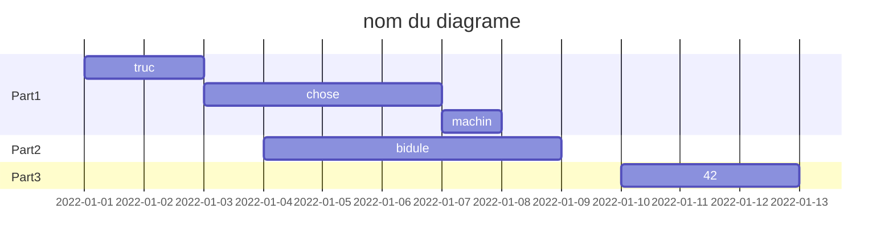

## Comment faire des diagrammes gantt
La syntaxe des diagrammes gantt est la suivante :

```mermaid
gantt 
    title nom du diagrame 
    section Part1 
        truc : 2022-01-01, 2d
        chose: 2022-01-03, 4d
        machin: 2022-01-07, 1d
    section Part2
        bidule: 2022-01-04, 5d
    section Part3
        42: 2022-01-10, 3d
```
